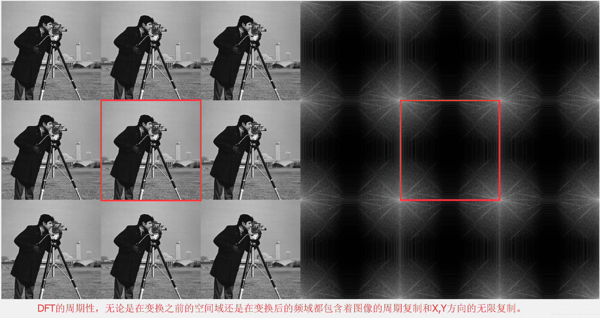
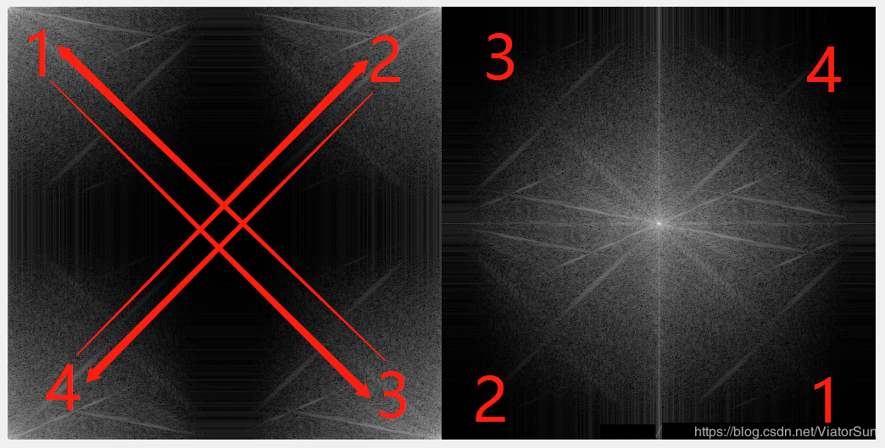
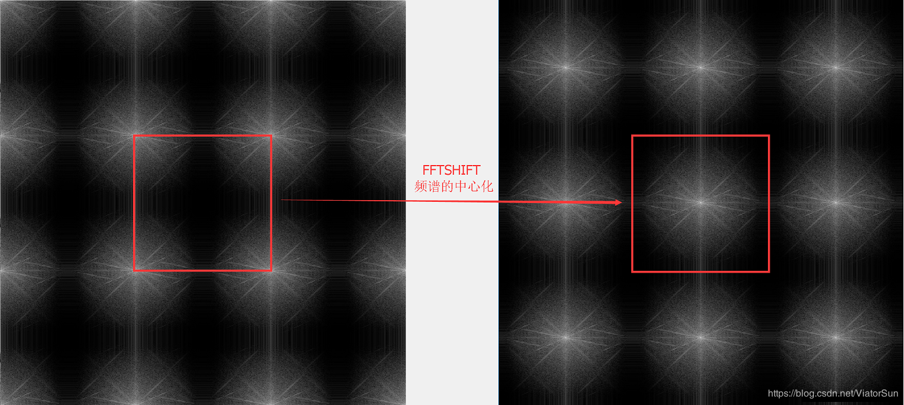
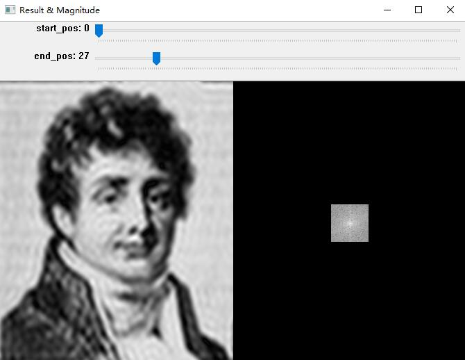
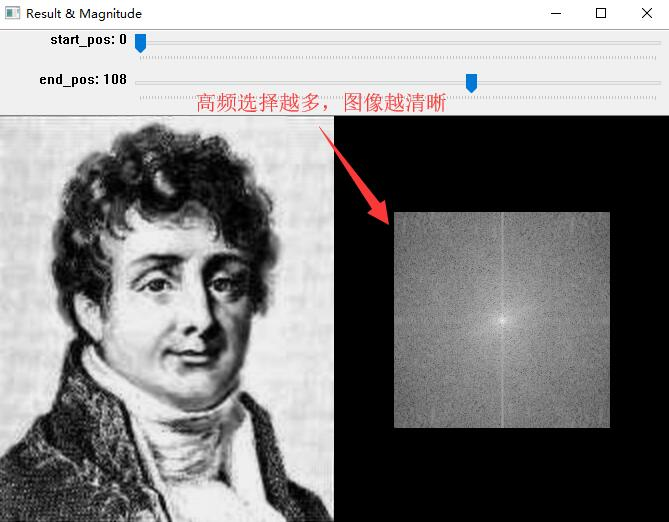
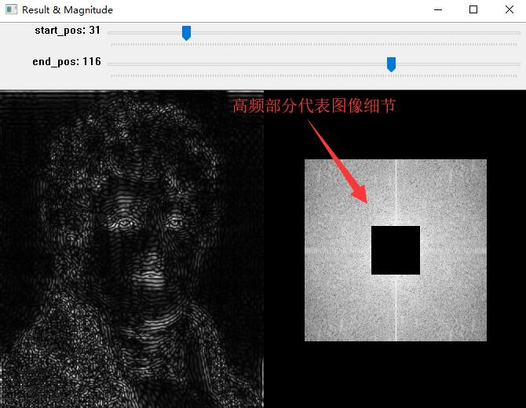

## 傅里叶变换
*Reference：https://www.youtube.com/watch?v=xhO8iz2qCOE&t=627s*

### 什么是图像上的傅里叶变换？
图像傅里叶变换是指对图像进行二维傅里叶变换，将图像上的点看作是时域上的周期信号，傅里叶变换后便成了频域上的信号。频域上利用不同多组不同频率的正弦（余弦）波来对原信号进行叠加，其最终频域上的图是利用`k`向量来表示一组信号，模长|k|代表频率w，其偏转角代表传播方向direction。 

 

图片中的频率可理解为图像`灰度值`在平面上的`变化梯度值`，`高频`代表`灰度值变化大`（图像中的`细节`），`低频`代表`灰度值变换平缓`（图像中的`平滑部分`）。

### 对图形进行傅里叶变换
1. 对原图像进行傅里叶变换（得到复数矩阵）。(cv2.dft())
2. 对频谱矩阵左上和右下调换，右上和左下调换，使得图片中心是整个频谱的最低频率点。(np.fft.ffshift())

 

 

 

3. 将频谱图（梯度变换图）映射到可视化范围(0~255)，使用np.log(cv2.magnitude())压缩数据范围。
3. 因为cv2中如果图像数据是float型，opencv会自动乘以255再显示，因此需要将所有值压缩到0.0 ~ 1.0之间。
4. 创建滤波器，滤掉部分高频（细节）或低频（轮廓）信号。
5. 反shift，并逆fft变换。
6. 同3一样，将结果进行数据归一化。

### 使用截图

 

 

 